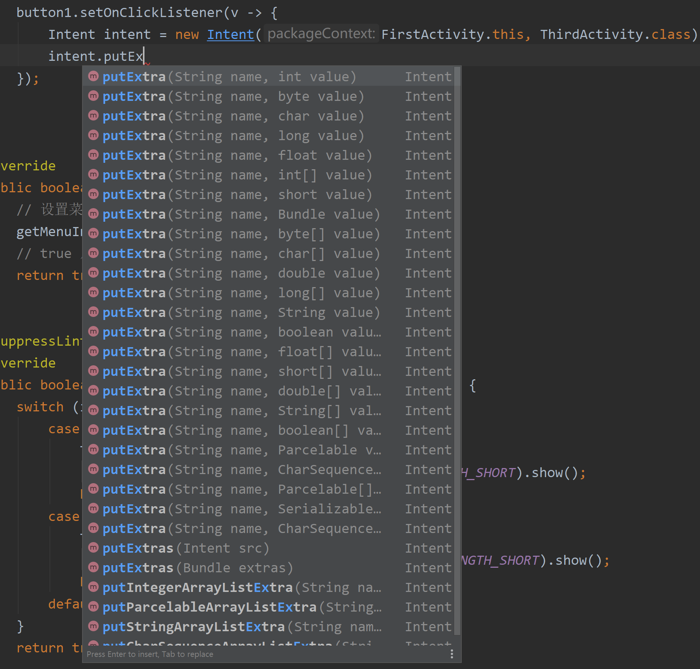
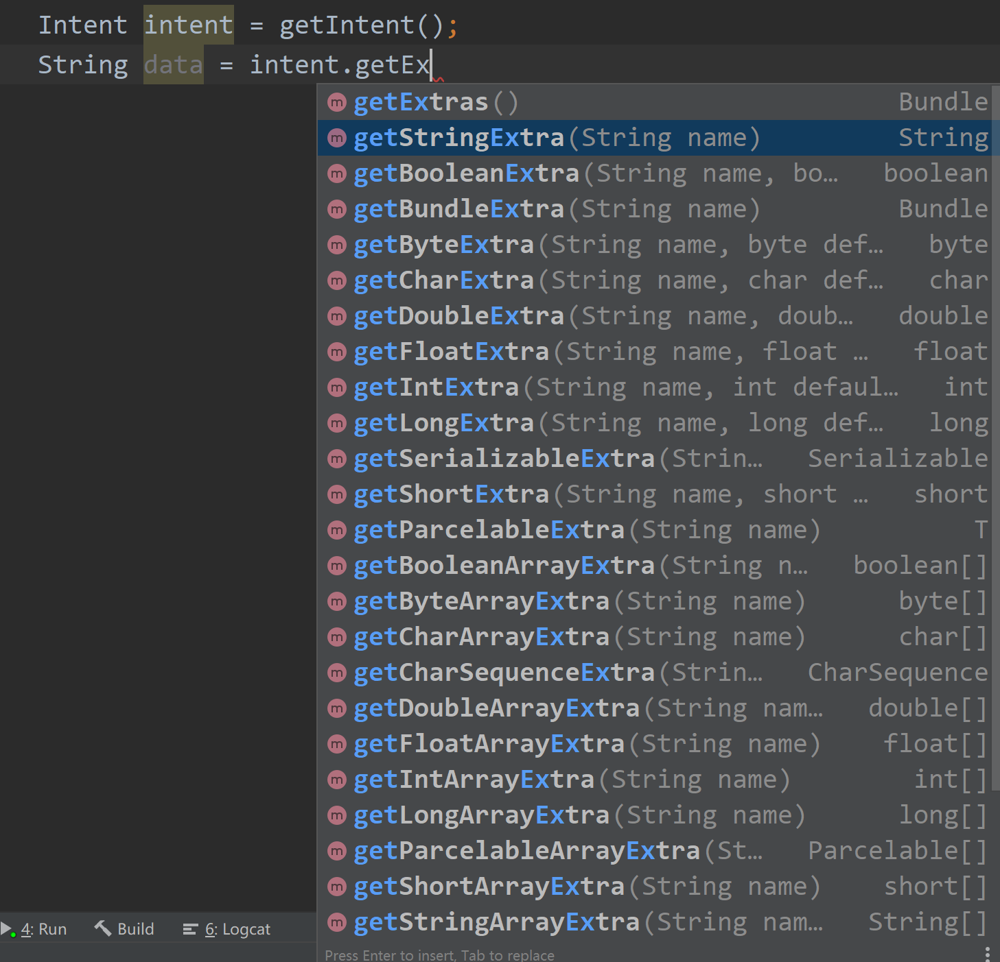
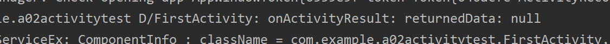
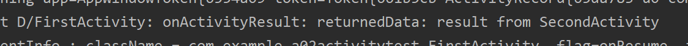

# Android Dev

## 参考

- [guolindev/booksource: 《第一行代码 第2版》全书源代码](https://github.com/guolindev/booksource)

- 《第一行代码》

## 前言

第一行代码 Android Studio 4.1.1 

开始时间 2020/11/29

### 总述

Android 期末，之前只是简单修改了 booksource 里的源码，这次期末结课有时间了，打算手动敲一遍书中的代码。要求完全尽量理解里面的代码，有问题的做个记录，后面解决。进度不能耽误。安排 4~5 天的时间完成。

### 时间安排

- 2020/11/29

  第 1 、2、3 章

- 2020/11/30

  第 4、5 章

- 2020/12/1

  第 6、7 章

- 2020/12/2

  第 9、10 章

- 2020/12/3

  第 11、12 章

- 2020/12/4（可选）

  第 13、14、15章

### 实际

- 2020/11/29

  第 1 、2 章

- 2020/11/30

  第 2 章

- 2020/12/1

  第  章

- 2020/12/2

  第 章

- 2020/12/3

  第 章

- 2020/12/4（可选）

  第 章

## 代码修改

- booksource 里用的 support 包现在基本改为了 androidx 目录下的

## 第一章 HelloWorld

- 日志打印

  在 onCreate 方法前

  输入 logt 然后 Tab 键，自动生成 TAG 常量，为当前活动名

- 自定义过滤器

## 第二章 活动

- 活动没在 Manifest 中注册会闪退。

- 在 res 下可以新建 menu 目录，再添加 menu.xml

- findViewById 需要在 layout 文件加载后再使用，否则 NULL Pointer 闪退

- 在 AndroidManifest 中，添加多个 category 属性时，不能注释掉默认的

  ```xml
  <intent-filter>
      <!--android:name 可以自己取-->
      <action android:name="com.example.a02activitytest.ACTION_START"/>
      <!--默认的 category, 每个 intent 会自动携带这个属性 不能注释下一行，否则闪退-->
      <category android:name="android.intent.category.DEFAULT"/>
      <!--  自定义 category，必须 action 和 category 同时符合要求才能启动此活动  -->
      <category android:name="com.example.a02activitytest.MyCategory"/>
  </intent-filter>
  ```

  

- 活动间传递信息用

  ```java
  //传信息
  intent.putExtra("key", value);
  ```

  

  有很多方法重载。

  下面是从活动2 获得相应的数据，指定类型的。

  

- startActivityForResult

  注意在 onActivityResult 方法中

  ```java
  // 此写法是错的，输出为 null
  String returnedData = getIntent().getStringExtra("data_return");
  // 正确写法
  String returnedData = data.getStringExtra("data_return");
  
  ```

  第一种错误写法

  

  正确写法

  

  此方法可以用于某活动调用 登录活动，登录活动看是否登录成功；成功后怎么处理，失败后怎么处理看 onActivityResult 方法（不知道这样是不是复杂了？应该是这样的，MainActivity 用于流程控制。）

  

  若用户按返回键返回上一个程序，没有数据返回，在 <font color=red>被调用活动中重写 onBackPressed 方法</font> 处理这种返回事件，可以返回数据给主调活动。

  所以说：主调活动中 onActivityResult 方法是在被调活动结束后调用，不管内部是怎么结束的（感觉说了一堆废话）。

  

- 活动生命周期

  

  - DialogActivity类需要继承自

    ```java
    package com.example.a02activitylifecycletest;
    
    import android.app.Activity;
    import android.os.Bundle;
    //  不能继承自AppCompatActivity，会闪退
    public class DialogActivity extends Activity {
    
        @Override
        protected void onCreate(Bundle savedInstanceState) {
            super.onCreate(savedInstanceState);
            setContentView(R.layout.activity_dialog);
        }
    }
    ```

    - 普通活动（是一个全屏活动，会使得 MainActivity 变得不可见）

      进入 MainActivity

      1. onCreate
      2. onStart
      3. onResume

      进入 NormalActivity

      1. onPause
      2. onStop

      返回 MainActivity

      1. onRestart
      2. onStart
      3. onResume

      退出主活动

      1. onStop
      2. onDestroy

    - DialogActivity（MainActivity 可见）

      进入 MainActivity

      1. onCreate
      2. onStart
      3. onResume

      进入 NormalActivity

      1. onPause

      返回 MainActivity

      1. onResume

      退出主活动

      1. onStop
      2. onDestroy

    - 对比

      DialogActivity运行时，MainActivity 始终可见，相对 NormalActivity 来说 

      没有 onStop onRestart onStart 这几个历程。

- onSaveInstanceState()

  若 A 启动活动 B，此时内存不足，活动 A 被销毁了，从 B 中返回 A 活动，会调用 A 的 onCreate 方法，

  最开始 A 中的临时数据都没了。这种情况需要用 onSaveInstanceState方法，此方法在活动被销毁前一定被执行，用于保存临时数据。

  不过不好调试这个。

- 启动模式
  - standard
  - singleTop
  - singleTask
  - singleInstance

#### 活动的最佳实践

待补充

##### 知晓当前是哪一个活动


##### 随时随地退出程序


##### 启动活动的最佳写法


#### 控件声明以及活动管理的方法

此方法来自 bilibili up 主，待补充。

## 第三章 UI

### TextView

