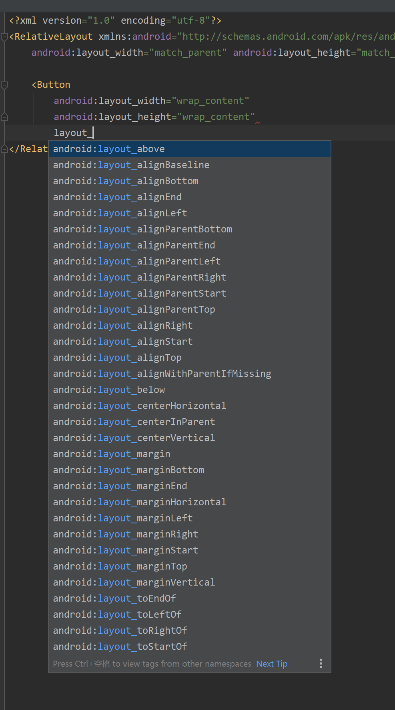
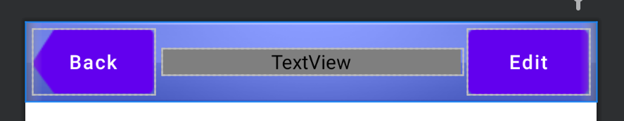

# Android Dev

## 参考

- [guolindev/booksource: 《第一行代码 第2版》全书源代码](https://github.com/guolindev/booksource)

- 《第一行代码》

## 前言

第一行代码 Android Studio 4.1.1 

开始时间 2020/11/29

### 总述

Android 期末，之前只是简单修改了 booksource 里的源码，这次期末结课有时间了，打算手动敲一遍书中的代码。要求完全尽量理解里面的代码，有问题的做个记录，后面解决。进度不能耽误。安排 4~5 天的时间完成。

### 时间安排

- 2020/11/29

  第 1 、2、3 章

- 2020/11/30

  第 4、5 章

- 2020/12/1

  第 6、7 章

- 2020/12/2

  第 9、10 章

- 2020/12/3

  第 11、12 章

- 2020/12/4（可选）

  第 13、14、15章

### 实际

- 2020/11/29

  第 1 、2 章

- 2020/11/30

  第 2 章

- 2020/12/1

  第  2、3章

- 2020/12/2

  第 3 章

  第 4 章 刚开始

- 2020/12/3

  第 4 章

- 2020/12/4

  第 5 章

## 代码修改

- booksource 里用的 support 包现在基本改为了 androidx 目录下的

## 第一章 HelloWorld

- 日志打印

  在 onCreate 方法前

  输入 logt 然后 Tab 键，自动生成 TAG 常量，为当前活动名

- 自定义过滤器

## 第二章 活动

- 活动没在 Manifest 中注册会闪退。

- 在 res 下可以新建 menu 目录，再添加 menu.xml

- findViewById 需要在 layout 文件加载后再使用，否则 NULL Pointer 闪退

- 在 AndroidManifest 中，添加多个 category 属性时，不能注释掉默认的

  ```xml
  <intent-filter>
      <!--android:name 可以自己取-->
      <action android:name="com.example.a02activitytest.ACTION_START"/>
      <!--默认的 category, 每个 intent 会自动携带这个属性 不能注释下一行，否则闪退-->
      <category android:name="android.intent.category.DEFAULT"/>
      <!--  自定义 category，必须 action 和 category 同时符合要求才能启动此活动  -->
      <category android:name="com.example.a02activitytest.MyCategory"/>
  </intent-filter>
  ```

  

- 活动间传递信息用

  ```java
  //传信息
  intent.putExtra("key", value);
  ```

  

  有很多方法重载。

  下面是从活动2 获得相应的数据，指定类型的。

  

- startActivityForResult

  注意在 onActivityResult 方法中

  ```java
  // 此写法是错的，输出为 null
  String returnedData = getIntent().getStringExtra("data_return");
  // 正确写法
  String returnedData = data.getStringExtra("data_return");
  
  ```

  第一种错误写法

  

  正确写法

  

  此方法可以用于某活动调用 登录活动，登录活动看是否登录成功；成功后怎么处理，失败后怎么处理看 onActivityResult 方法（不知道这样是不是复杂了？应该是这样的，MainActivity 用于流程控制。）

  

  若用户按返回键返回上一个程序，没有数据返回，在 <font color=red>被调用活动中重写 onBackPressed 方法</font> 处理这种返回事件，可以返回数据给主调活动。

  所以说：主调活动中 onActivityResult 方法是在被调活动结束后调用，不管内部是怎么结束的（感觉说了一堆废话）。

  

- 活动生命周期

  

  - DialogActivity类需要继承自 Activity 而不是 AppCompatActivity

    ```java
    package com.example.a02activitylifecycletest;
    
    import android.app.Activity;
    import android.os.Bundle;
    //  不能继承自AppCompatActivity，会闪退
    public class DialogActivity extends Activity {
    
        @Override
        protected void onCreate(Bundle savedInstanceState) {
            super.onCreate(savedInstanceState);
            setContentView(R.layout.activity_dialog);
        }
    }
    ```

    - 普通活动（是一个全屏活动，会使得 MainActivity 变得不可见）

      进入 MainActivity

      1. onCreate
      2. onStart
      3. onResume

      进入 NormalActivity

      1. onPause
      2. onStop

      返回 MainActivity

      1. onRestart
      2. onStart
      3. onResume

      退出主活动

      1. onStop
      2. onDestroy

    - DialogActivity（MainActivity 可见）

      进入 MainActivity

      1. onCreate
      2. onStart
      3. onResume

      进入 NormalActivity

      1. onPause

      返回 MainActivity

      1. onResume

      退出主活动

      1. onStop
      2. onDestroy

    - 对比

      DialogActivity运行时，MainActivity 始终可见，相对 NormalActivity 来说 

      没有 onStop onRestart onStart 这几个历程。

- onSaveInstanceState()

  若 A 启动活动 B，此时内存不足，活动 A 被销毁了，从 B 中返回 A 活动，会调用 A 的 onCreate 方法，

  最开始 A 中的临时数据都没了。这种情况需要用 onSaveInstanceState方法，此方法在活动被销毁前一定被执行，用于保存临时数据。

  不过不好调试这个。

- 启动模式
  - standard
  - singleTop
  - singleTask
  - singleInstance

#### 活动的最佳实践

待补充

##### 知晓当前是哪一个活动


##### 随时随地退出程序


##### 启动活动的最佳写法


#### 控件声明以及活动管理的方法

此方法来自 bilibili up 主，待补充。

## 第三章 UI

### 问题

- 写出的页面屏幕适应性不好
- ListView 和 RecycleView 看这书第一遍的时候没学会

### 前言

UI 属性很多，用的时候查文档。

### 控件

#### TextView

```xml
// 文字居中
android:gravity="center"
```

- 字体大小用 sp 为单位

#### Button

监听事件

- 匿名内部类
- 当前活动实现 View.OnClickListener 的 onClick 方法

#### EditText

```xml
android:hint="hint属性：提示信息"
android:maxLines="2" 文字显示最多的行数
```

---

获取 EditText 中的内容

```java
private EditText editText;
editText =findViewById(R.id.edit_text);
String text = editText.getText().toString();
```

#### ImageView

Java 代码修改图片源

```java
private ImageView imageView;
imageView =findViewById(R.id.image_view);
imageView.setImageResource(R.drawable.img_2);
```

#### ProgressBar

- 控件的共同属性 visibility

  

#### AlertDialog

### Layout

#### LinearLayout

- Layout 内控件的对齐方式

  ```xml
  android:layout_gravity="center"
  ```

- [android:layout_gravity 和 android:gravity 的区别 - 蝈蝈俊 - 博客园](https://www.cnblogs.com/ghj1976/archive/2011/04/26/2029535.html)

- [Android线性布局重要属性 - 知乎](https://zhuanlan.zhihu.com/p/29119838)

  - Android中的gravity属性有两种形式：layout_gravity和gravity，这两种有什么区别呢？

    从字面意思上就可以大概理解

    第一个layout_gravity控制控件在父布局中的位置（和margin比较类似），

    gravity可以控制控件中内容的显示位置（和padding比较类似）。

    - <font color=red>我之前认为的 layout_gravity 中的父布局是：假如现在是在一个 ImageView 中，父布局我会认为是 LinearLayout ，这个理解是错误的。正确理解的父布局是类似于 css 中的盒子模型，则 layout_gravity 和 margin 类似</font>

#### RelativeLayout

layout_*：是控件或者布局？的属性，相对于父布局或者 指定id的控件（仅RelativeLayout） 的位置，对 LinearLayout 和 RelativeLayout 都适用。



考虑多使用 layout_* 来定位，用 margin 屏幕适应性没那么好？


#### 自定义布局

```xaml
<?xml version="1.0" encoding="utf-8"?>
<LinearLayout xmlns:android="http://schemas.android.com/apk/res/android"
    android:orientation="horizontal"
    android:layout_width="match_parent"
    android:layout_height="wrap_content"
    android:background="@drawable/title_bg">

    <Button
        android:id="@+id/title_back"
        android:layout_width="wrap_content"
        android:layout_height="wrap_content"
        android:layout_gravity="center"
        android:layout_margin="5dp"
        android:background="@drawable/back_bg"
        android:text="Back"
        android:textAllCaps="false"
        android:textColor="#fff" />

    <TextView
        android:layout_width="wrap_content"
        android:layout_height="wrap_content"
        android:layout_gravity="center"
        android:layout_weight="1"
        android:gravity="center"
        android:text="Title Text"
        android:textColor="$fff"
        android:textSize="24sp"/>

    <Button
        android:layout_width="wrap_content"
        android:layout_height="wrap_content"
        android:layout_gravity="center"
        android:layout_margin="5dp"
        android:background="@drawable/edit_bg"
        android:text="Edit"
        android:textAllCaps="false"
        android:textColor="#fff"/>

</LinearLayout>
```




- [Android 中this、getContext()、getApplicationContext()、getApplication()、getBaseContext() 之间的区别 - petercao - 博客园](https://www.cnblogs.com/bluestorm/p/5842891.html)

#### ListView

#### 定制 ListView 

构成

- 实体类 Fruit

  存放 Fruit 信息，等于 DAO 设计模式里的 vo，用在 FruitAdapter 中的泛型。

- ListView 子项布局文件

- FruitAdapter 

  继承自 ArrayAdapter，重写 构造方法 和 getView 方法

  getView 这部分代码没懂。

- 将自定义的 FruitAdapter 添加到 ListView 中。

##### ListView 性能优化

- 重用 convertView
- 新建内部类缓存控件

##### ListView Item 点击事件

```
listView.setOnItemClickListener(new AdapterView.OnItemClickListener() {
})
```

```java
ListView listView = findViewById(R.id.list_view);
listView.setAdapter(fruitAdapter);
listView.setOnItemClickListener(new AdapterView.OnItemClickListener() {
    @Override
    public void onItemClick(AdapterView<?> parent, View view, int position, long id) {
        Fruit fruit = fruitList.get(position);
        Toast.makeText(MainActivity.this, fruit.getName(), Toast.LENGTH_SHORT).show();
    }
});
```

#### RecylcerView

ListView 中的性能优化代码迁移到了 Adapter 类中，布局和 vo 类没变。

##### 横向滚动和瀑布流布局

- 修改 layout.xml 文件（我的代码里是新建的 布局文件，修改 FruitAdapter 中传入的布局为新建的布局文件）
- Java 代码设置 layoutManager  相关参数

##### 点击事件

需要自己在 Adapter 类中定义控件的点击事件

## 第四章 探究碎片

- 开始不太明白 fragment 的意义
  - 在于可以替换布局？适配安卓平板？

### 动态加载布局的技巧

#### 使用限定符

#### 使用最小宽度限定符

P159

### 碎片实践

## 第五章 广播机制

广播执行时间很短，执行时间超过 10s 会显示应用无响应，onReceive 方法中不能做太复杂的逻辑

#### 动态注册广播接收器

Java 代码注册

检测网络状态

#### 静态注册广播接收器

AndroidManifest.xml 里注册

开机自启

#### 发送标准广播

```java
// 发送广播                        
Intent intent = new Intent("com.example.a0501broadcasttest.MY_BROADCAST");
sendBroadcast(intent);
```

5.3.1 中的发送标准广播发现问题

- 使用 AndroidManifest.xml 注册 receiver，无效。查阅以下文档后发现

  - [隐式广播例外情况  |  Android 开发者  |  Android Developers](https://developer.android.com/guide/components/broadcast-exceptions?hl=zh-cn)
  - [从 Android 8.0（API 级别 26）开始，系统对清单声明的接收器施加了额外的限制](https://developer.android.com/guide/components/broadcasts?hl=zh-cn#android_80)

  我用的 API 30，所以自定义的隐式广播用 AndroidManifest 文件注册接收器方法无效了。

  只能使用 动态注册。而前面一个例子中的 

  `android.intent.action.BOOT_COMPLETED` 是例外，依然可以使用。

#### 发送有序广播

